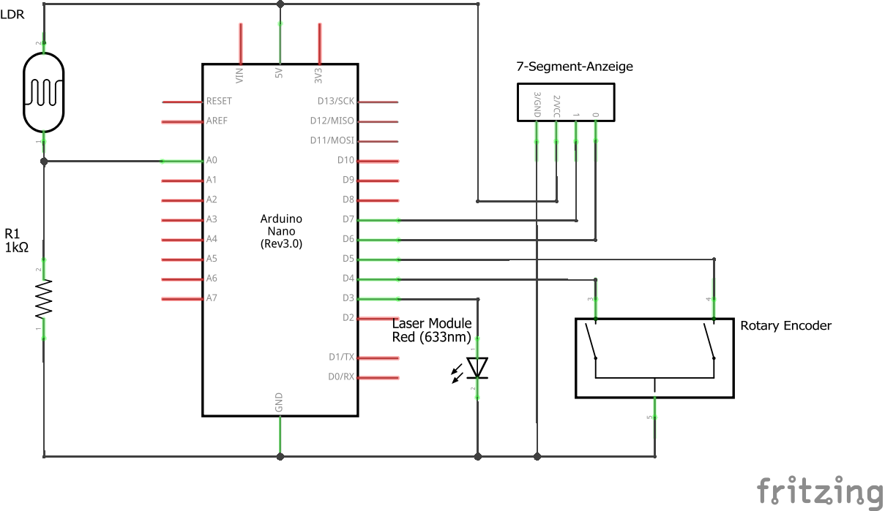

# LaTra - LaserTransceiver
An Arduino library and project to transceive data via laser.

# Circuit Diagram

(nicht 633nm)
# History

07.07.2019 v0.1_TC * Erste Version\
07.07.2019 v0.2_TC * Dekodierlogik von unknown hinzugefügt - unvollständig!!!\
11.07.2019 v0.3_TC * Dekodierlogik funktioniert! Senden und empfangen aus dem gleichen Sketch!\
19.07.2019 v0.4_TC * Cleanup und Kommandos über Serial\
30.01.2020 v0.5_AK * Kommentare; getAnalogValueLaserHIGH-Kommando; Laser und Ldr inverted Funktion
